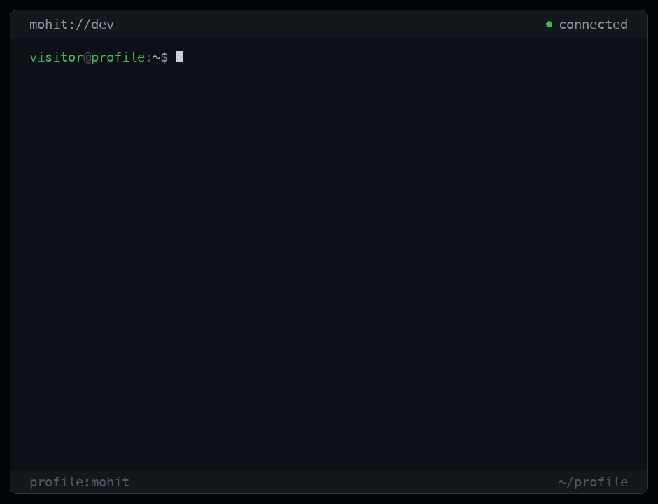

<picture>
  <source media="(prefers-reduced-motion: reduce)" srcset="./assets/terminal-static.png">
  
</picture>

## `$ whoami`

Computer Engineering at Purdue, graduating Dec 2027. Most recently a Software
Engineer Intern at IBM, before that Handshake and Caterpillar. I build close to
the machine — currently a KV cache for LLM inference with a C storage core and a
Go control plane running Raft — and I care most about what systems do under load
and how they fail.

## `$ ps --projects`

**[pulsekv](https://github.com/MohitManna-2006/pulsekv)** · `distributed systems`<br>
Sharded KV store for LLM inference. C core on `epoll`, Go control plane running
Raft, Python adapters for SGLang and vLLM.

**[tessera](https://github.com/MohitManna-2006/tessera)** · `developer tooling`<br>
Turns your repos and résumé into a portfolio you can actually deploy. Next.js,
server-side PDF extraction, deterministic export.

**[fintrak](https://github.com/MohitManna-2006/fintrak)** · `applied ai`<br>
Finance tracker with an LLM in the loop. Next.js on Prisma and Postgres, shared
rooms, streaming spend analysis.

**[personal-portfolio](https://github.com/MohitManna-2006/personal-portfolio)** · `web`<br>
Portfolio built as a technical artifact, not a résumé dump. Next.js, TypeScript,
Tailwind.

## `$ cat experience.log`

```
IBM           Software Engineer Intern    May – Aug 2026
Handshake     AI Engineer                 Jan – Apr 2026
Caterpillar   Machine Learning Intern     Aug – Dec 2025
Stealth AI    Software Engineer Intern    Jun – Aug 2025

Purdue University · BS Computer Engineering · Dec 2027
Minors in Math and Finance
```

## `$ env`

```
languages  Python · TypeScript · C · C++ · Go · SQL
systems    Linux · epoll · Raft · gRPC · concurrency
backend    FastAPI · Node.js · PostgreSQL · Redis
ai         PyTorch · vLLM · RLHF · pgvector
infra      Docker · Kubernetes · AWS · Azure
web        React · Next.js · GraphQL · Tailwind
```

## `$ ping --contact`

[Portfolio](https://tinyurl.com/mohit542) · [LinkedIn](https://linkedin.com/in/mohit542) · [Email](mailto:mannamohit542@gmail.com) · [GitHub](https://github.com/MohitManna-2006)

<sub>The header is generated from source — see <a href="./terminal/">terminal/</a>.</sub>
